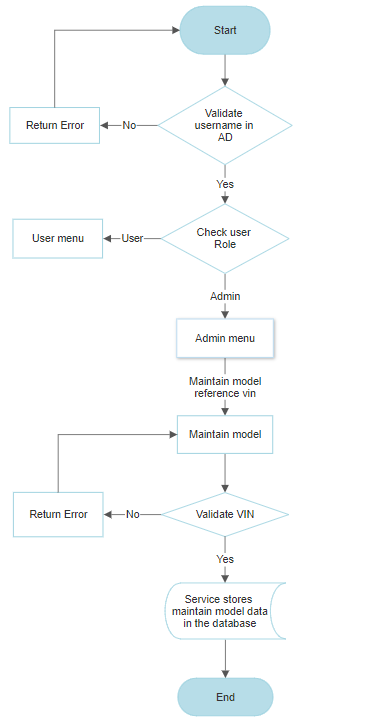
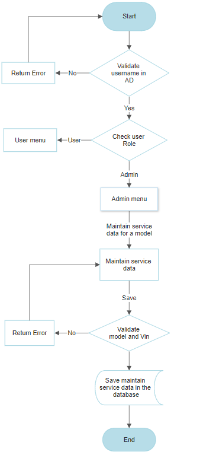
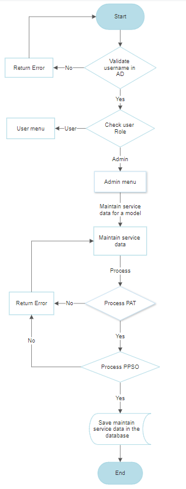
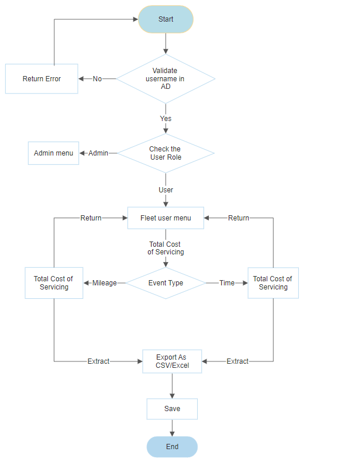
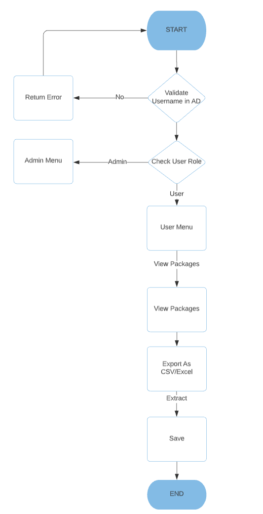
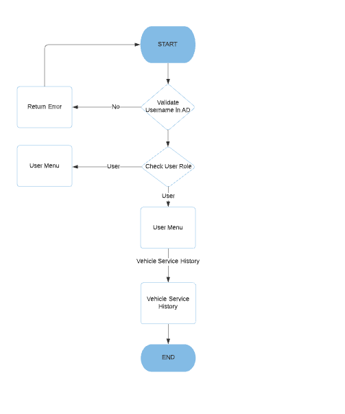
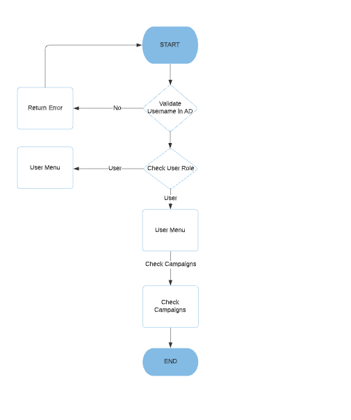

# VWS

## PPSO for Special Markets

### Technical Specification Document

 Version 1.1.0

# Document Information

## Change History

| **Date**   | **Version** | **Changed Chapters**  | **Author**    |
| ---------- | ----------- | --------------------- | ------------- |
| 2021/09/20 | 1.0.0       | Initial Documentation | Olwethu Mbada |
| 2021/10/04 | 1.0.1       | Stage 2               | Storm Chambel |
| 2021/10/13 | 1.0.2       | Stage 3               | Storm Chambel |
| 2022/02/18 | 1.0.3       | Stage 4 and Stage 5   | Storm Chambel |

## Review Record

| **Date**   | **Reviewed Version** | **Comments**     | **Reviewer**  |
| ---------- | -------------------- | ---------------- | ------------- |
| 2021/09/20 | 1.0.0                | Initial Document | Olwethu Mbada |
|            |                      |                  |               |
|            |                      |                  |               |

## Open Issues

| **Date** | **Description** | **Resolution** | **Responsible** |
| -------- | --------------- | -------------- | --------------- |
|          |                 |                |                 |
|          |                 |                |                 |
|          |                 |                |                 |

# Overview

## Technology Used

\- C\# .NET Core 5.0

\- Entity Framework

\- Active Directory

\- Angular

\- MSSql Server

## The Components

1.  The PPSO application is comprised of two main components, the independent data access layer and two business sides:

\- A web application used for to maintain model data, maintain service for model and provide special market to retrieve total cost of servicing a vehicle. (Angular)

\- A service used for saving data to the database and get weekly updates of models, fetching of ppso and catalog data from RWIL and fetching of servicing events from PAT (Independent data access layer written in C\#).

## The Process

The Process Flow is as follows:

1.  Maintain Model Reference Vin.
    
    1.  A user will click on the link that will redirect them to the application, the application retrieves the logged in user username from the server, then validates if the user exists in the Active Directory. If it does not exist the system will return an error that invalid login details. If the user exists the system will retrieve personal details (Full name and user role) of the user from the perspective Active Directory group then the process moves to step 3.
    
    2.  The system will check the role of the user. If the user is a Vendor they will be directed to the Fleet user menu. If the user is Admin they will be directed to the Admin menu.
    
    3.  From Admin menu the user selects the “Maintain Model Reference Vin” button. The user will be redirected to the maintain model reference vin screen. The user selects the Brand, Model code and enters a vin. The system validates the vin, if it is not valid the system will return an error, if the vin is valid the system will save the maintain model data to the database and return a response to notify that the vin is saved.

2.  Maintain service data for a model
    
    1.  A user will click on the link that will redirect them to the application, the application retrieves the logged in user username from the server, then validates if the user exists in the Active Directory. If it does not exist the system will return an error that invalid login details. If the user exists the system will retrieve personal details (Full name and user role) of the user from the perspective Active Directory group then the process moves to step 3.
    
    2.  The system will check the role of the user. If the user is a Vendor they will be directed to the Fleet user menu. If the user is Admin they will be directed to the Admin menu.
    
    3.  From the Admin menu the user selects the “Maintain Service Data for a Model” button. The user will be redirected to the maintain service data screen. The user selects the Brand, Model code and the vin is populated to the appropriate input field, the user continues and enters the delivery date, start mileage, end mileage and lifespan. The user saves the information provided, the system validates the that user has provided all the necessary information, if not then the system will return an error, if the information is valid the system will save the maintain service data to the database and return a response to notify the that the data is saved.
    
    4.  The user selects the “Process” button. The system sends a PAT request for the provided delivery date and vin, if the connection to PAT is not successful the system will return an error, if the connection is successful the system will proceed to connect to RWIL. If the connection to RWIL is not successful the system will return an error, if the connection is successful the system will fetch catalog data, PPSO, and PPSO positions and save them to the database and return a response that the data is saved.

3.  Total cost of servicing a vehicle.
    
    1.  A user will click on the link that will redirect them to the application, the application retrieves the logged in user username from the server, then validates if the user exists in the Active Directory. If it does not exist the system will return an error that invalid login details. If the user exists the system will retrieve personal details (Full name and user role) of the user from the perspective Active Directory group then the process moves to step 3.
    
    2.  The system will check the role of the user. If the user is an Admin, they will be directed to the Admin menu. If the user is Vendor they will be directed to the Fleet user menu.
    
    3.  The user selects the “Total Cost of Servicing” button, a pop up will appear and the user will choose the event type. If the user chooses the Mileage, the user will be redirected to the total cost of servicing a vehicle (mileage) screen. The user will then select the Brand, Model code and the event, the table for total cost of servicing a vehicle will be populated with the appropriate information based on mileage. If the user chooses Time, the user will be redirected to the total cost of servicing a vehicle (time) screen. The user will then select the Brand, Model code and the event, the table for total cost of servicing a vehicle will be populated with the appropriate information based on time. If the user selects return they will be redirected to the Fleet user menu screen. If the user selects extract a pop will appear and the user will select either CSV or Excel then save the file to the appropriate directory on their machine.

4.  Delete Service Data for a Model.
    
    1.  A user will click on the link that will redirect them to the application, the application retrieves the logged in user username from the server, then validates if the user exists in the Active Directory. If it does not exist the system will return an error that invalid login details. If the user exists the system will retrieve personal details (Full name and user role) of the user from the perspective Active Directory group then the process moves to step 3.
    
    2.  The system will check the role of the user. If the user is an Admin, they will be directed to the Admin menu. If the user is Vendor they will be directed to the Fleet user menu.
    
    3.  From Admin menu the user selects the “Delete Service Data for a Model” button. The user will be redirected to the maintain model reference VIN screen. The user selects the Brand, Model code and enters a VIN. The system validates the VIN, if it is not valid the system will return an error, if the VIN is valid the system will delete the model service data from the database and return a response to notify that the service data is deleted.

5.  View Packages
    
    1.  A user will click on the link that will redirect them to the application, the application retrieves the logged in user username from the server, then validates if the user exists in the Active Directory. If it does not exist the system will return an error that invalid login details. If the user exists the system will retrieve personal details (Full name and user role) of the user from the perspective Active Directory group then the process moves to step 3.
    
    2.  The system will check the role of the user. If the user is an Admin, they will be directed to the Admin menu. If the user is Vendor they will be directed to the Fleet user menu.
    
    3.  The user selects the “View Packages” button, the user will be redirected to the view packages screen. The user will then select the Brand, Model code and the VIN will be filled according to model code and then “Load” button is clicked. When “Load” button is clicked the package category drop down is populated with appropriate categories which a category is selected. When a Category is selected the Category Sub Packages drop down gets populated , the table for view packages will be populated with the appropriate information. If the user selects extract a pop will appear and the user will select either CSV or Excel then save the file to the appropriate directory on their machine.

6.  Vehicle Service History
    
    1.  A user will click on the link that will redirect them to the application, the application retrieves the logged in user username from the server, then validates if the user exists in the Active Directory. If it does not exist the system will return an error that invalid login details. If the user exists the system will retrieve personal details (Full name and user role) of the user from the perspective Active Directory group then the process moves to step 3.
    
    2.  The system will check the role of the user. If the user is an Admin, they will be directed to the Admin menu. If the user is Vendor they will be directed to the Fleet user menu.
    
    3.  The user selects the “Vehicle Service History” button, the user will be redirected to the vehicle service history screen. The user will then enter the VIN and click the “Check” button. When “Check” button the table for vehicle service history will be populated with the appropriate information. If the user selects extract a pop will appear and the user will select either CSV or Excel then save the file to the appropriate directory on their machine.

7.  Check Campaigns
    
    1.  A user will click on the link that will redirect them to the application, the application retrieves the logged in user username from the server, then validates if the user exists in the Active Directory. If it does not exist the system will return an error that invalid login details. If the user exists the system will retrieve personal details (Full name and user role) of the user from the perspective Active Directory group then the process moves to step 3.
    
    2.  The system will check the role of the user. If the user is an Admin, they will be directed to the Admin menu. If the user is Vendor they will be directed to the Fleet user menu.
    
    3.  The user selects the “Check Campaigns” button, the user will be redirected to the campaign check screen. The user will then enter the VIN and click the “Check” button. When “Check” button the table for check campaigns will be populated with the appropriate information.

8.  Part Look Up
    
    1.  A user will click on the link that will redirect them to the application, the application retrieves the logged in user username from the server, then validates if the user exists in the Active Directory. If it does not exist the system will return an error that invalid login details. If the user exists the system will retrieve personal details (Full name and user role) of the user from the perspective Active Directory group then the process moves to step 3.
    
    2.  The system will check the role of the user. If the user is an Admin, they will be directed to the Admin menu. If the user is Vendor, they will be directed to the Fleet user menu.
    
    3.  The user selects the “Part Look Up” button, the user will be redirected to the part look up screen. The user will then enter the part number or super seeded part number in the text box and click the “Price” button. When “Price” button clicked. That will fill the text boxes with appropriate information including price, description, part number and super seeded number if it was used.

9.  Crafter Service Intervals
    
    1.  On the Admin portal, the user will click on “**Maintain Service Intervals” and be redirected to the Service Intervals screen.**
    
    2.  **The user can click on the “+” button to add a new crafter model.**
    
    3.  **The user can click on “Edit”**  **button to edit an existing entry.**
    
    4.  **The user can click on “Delete”**  **button to delete an existing service interval**
    
    5.  **The data captured here is used on the “Total Cost of Servicing” and “View Packages” screens to display the appropriate intervals for Crafters.**

10. Fluid Mapping
    
    1.  On the Admin portal, the user will click on “**Maintain Fluid Mapping Table” and be redirected to the Fluid Mapping screen.**
    
    2.  **The user can click on the “+” button to add a new Fluid map.**
    
    3.  **The user can click on “Edit”**  **button to edit an existing Fluid map.**
    
    4.  **The user can click on “Delete”**  **button to delete an existing Fluid map.**
    
    5.  **The data captured here is used on the “Total Cost of Servicing” and “View Packages” screens to display the appropriate fluid part number.**

11. Usage Reports for Business
    
    1.  On the Admin portal, the user will click on “**View Usage Reports” and be redirected to the Service Intervals screen.**
    
    2.  **The user will see a grid with the first page of usage reports**
    
    3.  **The user can sort the grid by clicking on any column header**
    
    4.  **The user can search a column by using the search bar underneath the column header**
    
    5.  **The user can search the entire dataset by using the search bar at the top right of the grid**

12. **Manual Data Maintenance**
    
    1.  On the Admin portal, the user will click on “**Maintain Service Data for a Model (PPSO)” and be redirected to the Manual Data Maintenance screen.**
    
    2.  **The user selects a brand, Model Code, Event Type and Package Category from the dropdowns**
    
    3.  The user can drag packages from the list on the left to the list on the right to add packages to the list
    
    4.  The user can copy the packages to other events by clicking “Save” and selecting the events in the popup that follows
    
    5.  The user can save all changes by clicking “Continue” on the Events popup.
    
    6.  Data captured here is used on the “Total Cost of Service” and “View Packages” to populate the package contents.

## Process Flow Diagram

1.  Maintain Model Reference VIN

2.  Maintain Service Data for a Model

3.  Total Cost of Servicing a Vehicle

4.  Delete Model Service Data

5.  View Packages

6.  Vehicle Service History

7.  Check Campaigns

8.  Part Look Up

